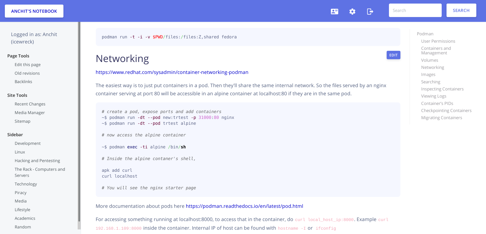
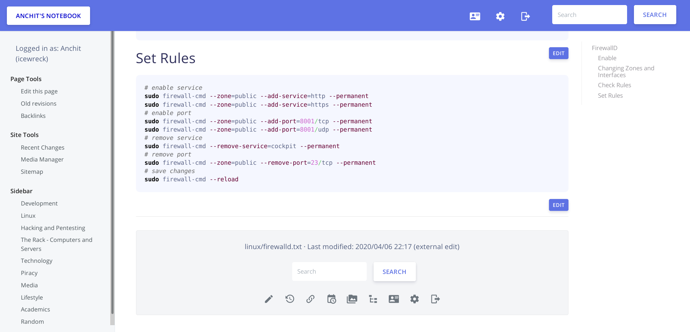
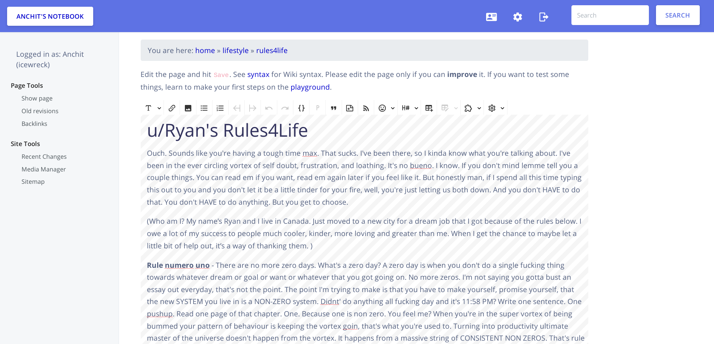
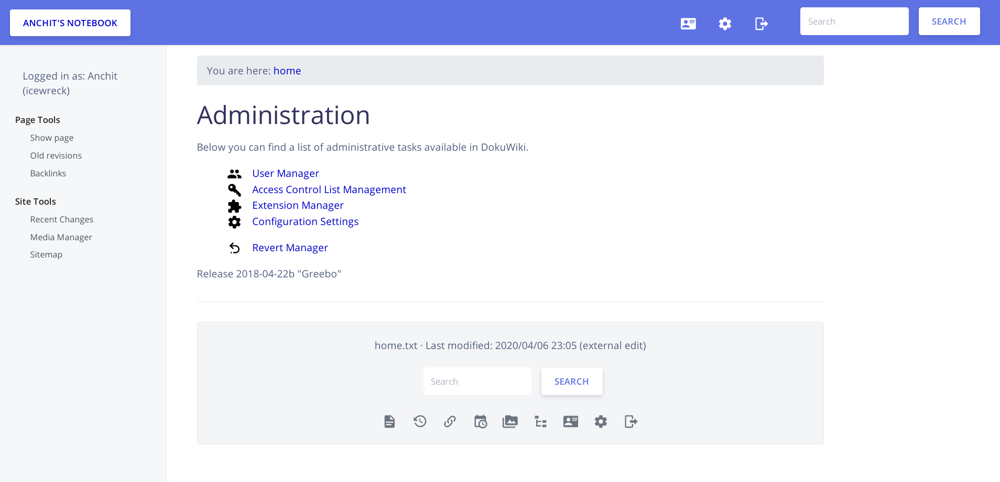

# Argon Dokuwiki Template

Argon - a clean, responsive, modern template for Dokuwiki.
https://www.dokuwiki.org/template:argon



## Sidebar

If you have a sidebar, then put your links (in the sidebar) in bullet points to ensure consistent styling with the rest of the template.

## Styling

I've imported the base stylesheet from the argon design system and then added custom styles on top in the ___assets/css/doku.scss___ file. The file is then compiled to CSS using SASS.

To do changes and have it compile live, do
```
sass --watch assets/css/doku.scss assets/css/doku.css
```

## Contributors

- [IceWreck](https://github.com/IceWreck)
- [SoarinFerret](https://github.com/SoarinFerret)
- [llune](https://github.com/llune)

## Credits
* Creative Tim for the [Argon Design System](https://github.com/creativetimofficial/argon-design-system) stylesheet. 
* [Anika Henke](https://github.com/selfthinker) for her starter dokuwiki template.

## More Screenshots





